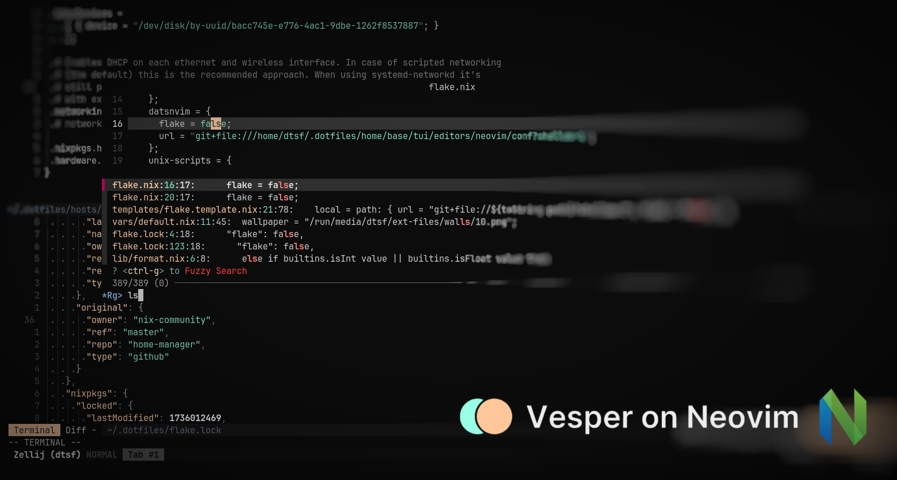

# 🍸 Vesper

Port of the VS Code theme, [Vesper](https://github.com/raunofreiberg/vesper) for Neovim - written in Lua. The theme is designed to be easy on the eyes and focuses on the code.



## ✨ Features

- Supports the latest [Neovim](https://github.com/neovim/neovim) [0.9.0](https://github.com/neovim/neovim/releases/tag/v0.9.0) features.
- Enhances terminal colors.
- Introduces a darker background option for sidebar-like windows.
- Supports all major plugins.

## 📦 Requirements

- [Neovim](https://github.com/neovim/neovim) >= 0.7.2

## ⚡️ Installation

Install the theme with your preferred package manager, I recommended [folke/lazy.nvim](https://github.com/folke/lazy.nvim):

```lua
{
    "PunGrumpy/vesper.nvim",
    lazy = true,
    priority = 1000,
    opt = {}
}
```

## 🚀 Usage

### Vim Script

```vim
colorscheme vesper
```

### Lua

```lua
vim.cmd[[colorscheme vesper]]
```

## ⚙️ Configuration

[Vesper](https://github.com/PunGrumpy/vesper.nvim) uses the default options, unless `setup` is called.

```lua
require("vesper").setup({
  -- your configuration comes here
  -- or leave it empty to use the default settings
  transparent = true, -- Enable this to disable setting the background color
  terminal_colors = true, -- Configure the colors used when opening a `:terminal` in [Neovim](https://github.com/neovim/neovim)
  styles = {
    -- Style to be applied to different syntax groups
    -- Value is any valid attr-list value for `:help nvim_set_hl`
    comments = { italic = true },
    keywords = { italic = true },
    functions = {},
    variables = {},
    -- Background styles. Can be "dark", "transparent" or "normal"
    sidebars = "dark", -- style for sidebars, see below
    floats = "dark", -- style for floating windows
  },
  sidebars = { "qf", "help" }, -- Set a darker background on sidebar-like windows. For example: `["qf", "vista_kind", "terminal", "packer"]`
  day_brightness = 0.3, -- Adjusts the brightness of the colors of the **Day** style. Number between 0 and 1, from dull to vibrant colors
  hide_inactive_statusline = false, -- Enabling this option, will hide inactive statuslines and replace them with a thin border instead. Should work with the standard **StatusLine** and **LuaLine**.
  dim_inactive = false, -- dims inactive windows
  lualine_bold = false, -- When `true`, section headers in the lualine theme will be bold

  --- You can override specific color groups to use other groups or a hex color
  --- function will be called with a ColorScheme table
  ---@param colors ColorScheme
  on_colors = function(colors) end,

  --- You can override specific highlights to use other groups or a hex color
  --- function will be called with a Highlights and ColorScheme table
  ---@param highlights Highlights
  ---@param colors ColorScheme
  on_highlights = function(highlights, colors) end,
})
```

## 🆘 Contributing

Contributions are welcome, please open an issue if you encounter any bug or if you find any improvements are needed for the code, also feel free to open a PR.

## 📝 License

[MIT License](LICENSE) for more information.
